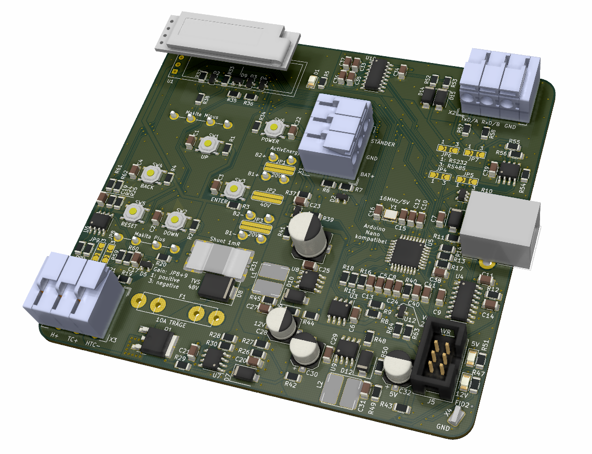

HTL Lötregler Mini
==================

Einfacher Regler für JBC Lötspitzen der Serie T210, T245 und T470, Weller RT-Spitzen und TS100-Spitzen sollten auch funktionieren.

Vorrangig SMD-Bauteile, Größe 3216. 
Bauteilauswahl für Handbestückung ohne SMD-Schablone optimiert

Design ist möglichst kostengünstig, speziell für Schüler-Budget. 

# Merkmale:
## Controller
* ATmega328, Kompatibel zu Arduino Nano
* 5V, 16MHz
* externe 2.5V Spannungsreferenz für ADC

## Stromversorgung
* Spannungsversorgung: 15 bis 48V, Akku oder Netzteil
* Tiefentladeschutz
* 10A Schmelzsicherung
* 48V TVS-Schutzdiode
* Ein-/Aus-Taster
* Schaltregler von Vin auf 12V und 5V
* 6.3 mm Flachsteckverbinder für die direkte Kontaktierung von 18V Makita Akkus, oder Hofer ActivEnergy Akkus mit 20 oder 40V. 

## Leistungsteil
* Highside N-Kanal MOS-FET: 80V, 10mR (geringe Verlustleistung, hohe Spannungsfestigkeit)
* zugehöriger Gatetreiber: notwendig für N-Kanal MOS-FET

## Sensorik
* Messverstärker zur Temperaturmessung der Lötspitze (24 µV/K)
* Spannungsmessung der Versorgung
* Messung der Leiterplattentemperatur
* Strommessung des Heizelements über 1mR-Shunt

## Benutzerschnittstelle
* OLED Display mit 128x32 Pixel, 23mm Diagonale
* 4 Bedientaster (Rauf, Runter, Enter, Zurück)

## Kommunikation
* Arduino USB
* AVR ISP
* Wahlweise
  * RS232
  * oder RS485 zur Kommunikation mit einem Steuerbaren Netzgerät (12, 24, 48V). 

